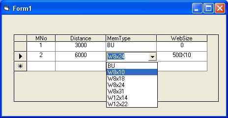

<div align="center">

## Combining DBGrid & Combo


</div>

### Description

Often I use to thought of using a particular cell of DBGrid control as a Combo box, so that user can select using the combo box.This facility is available in MS Access.       This code shows how to combine DBGrid control and a combo box in VB, so that whenever the user clicks a particular cell if DBGrid control this combo box is visible and user can select the value from the combo box.
 
### More Info
 


<span>             |<span>
---                |---
**Submitted On**   |
**By**             |[AR\. Sithanandam](https://github.com/Planet-Source-Code/PSCIndex/blob/master/ByAuthor/ar-sithanandam.md)
**Level**          |Advanced
**User Rating**    |4.3 (13 globes from 3 users)
**Compatibility**  |VB 5\.0, VB 6\.0
**Category**       |[Custom Controls/ Forms/  Menus](https://github.com/Planet-Source-Code/PSCIndex/blob/master/ByCategory/custom-controls-forms-menus__1-4.md)
**World**          |[Visual Basic](https://github.com/Planet-Source-Code/PSCIndex/blob/master/ByWorld/visual-basic.md)
**Archive File**   |[](https://github.com/Planet-Source-Code/ar-sithanandam-combining-dbgrid-combo__1-57865/archive/master.zip)


### Source Code

```
STEP1 - Put a DBGrid Control on a Form and connect it to a Data Control
STEP2 - put a combo box over the DBGrid and set the visible property to False and set the
    width of the Combo equal to width of a particular Column of DbGrid control,
    which you want to populate the data.
STEP3 - Add the following code in Form_Load, DbGrid1_Rowcolchange and Combo1_Click() Events
Private Sub Form_Load()
 'POPULATE THE COMBO BOX WITH THE DESIRED VALUES
 Combo1.AddItem "MYTEXT1"
 Combo1.AddItem "MYTEXT2"
 Combo1.AddItem "MYTEXT3"
'ALTERNATIVELY, COMBO BOX CAN ALSO BE POPULATED WITH DATA FROM A TABLE.
End Sub
Private Sub DBGrid1_RowColChange(LastRow As Variant, ByVal LastCol As Integer)
 Dim Currentrow, CurrentCol
 Currentrow = DBGrid1.Row
 CurrentCol = DBGrid1.Col
 ' HERE THE VALUE 2 MEANS, THE PARTICULAR
'  COLUMN WHICH REQUIRES THE LIST OF DATA
 ' FROM COMBO BOX.
 If CurrentCol = 2 Then
  Combo1.Visible = True
  Combo1.Top = Me.DBGrid1.RowTop(Currentrow) + DBGrid1.RowHeight
  Combo1.Left = 1950
  Combo1.Width = 980
  Combo1.Text = DBGrid1.Text ' ASSIGNING
  ' PARTICULAR CELL VALUE OF DBGRID TO COMBO
  Else
  Combo1.Visible = False
 End If
End Sub
Private Sub Combo1_Click()
 DBGrid1.Col = 2
 DBGrid1.Text = Me.Combo1.Text ' ASSIGNING THE
  ' COMBO VALUE TO PARTICULAR CELL OF DBGRID
End Sub
```

